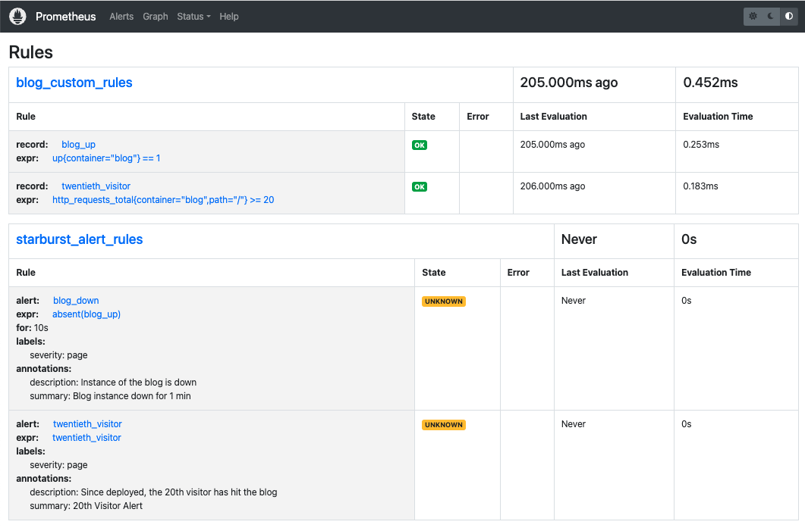
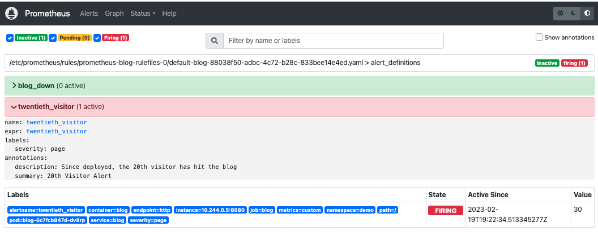

# Kubernetes Metrics Workshop


**Prereqs**
- [Kind](https://kind.sigs.k8s.io/) installed on your machine
- [Docker](https://docker.com) or tool to build container images
- [Dockerhub](https://hub.docker.com/) or other image registry account
- [Go](https://go.dev/) version 1.19 or higher (Not pertinent to workshop, but needed for the demo)

**TOC**
- [Demo Background](#demo-background)
- [Instrumenting in Go 101](#instrumenting-in-go-101)
- [Spin up a Kubernetes Cluster](#spin-up-a-kubernetes-cluster)
- [Deploy the Demo App](#deploy-the-demo-app)
- [Deploy Prometheus Operator](#deploy-prometheus-operator)
- [Configure Prometheus](#configure-prometheus)
- [Clean Up](#clean-up)


## Demo Background

_In this demo, we are going to deploy a Go application (Fake Blog Server) that emits metrics to a Prometheus server. We are going to look at several key features of Prometheus, including `externalLabels` to identify metrics in a federated environment, `remoteWrite` to demonstrate how metrics can be federated across environments, `prometheusRules` to define and trigger alerts, `serviceMonitors` to tell Prometheus what to scrape and finally, we will briefly chat about debugging your metrics environment. The first section is `Instrumenting in Go 101`, and can be skipped if you just want to skip to the interactive demo._

## Instrumenting in Go 101

This workshop is mostly about Kubernetes, but we need to know how to instrument our application to emit metrics. This part will be quick, but if you are interested in learning more about instrumenting your application in Go, check out the [`main.go`](main.go) where I have instrumented custom metrics for:
- `httpDuration`
- `responseStatus`
- `totalRequests`.

I should also note that I have created an endpoint in the app that can receive metrics from Prometheus's remoteWrite endpoint, so our application can receive metrics, and it also emits metrics. This is useful for testing purposes, but in reality, you would only want to emit metrics from your application.


```go
func handleMetrics(w http.ResponseWriter, r *http.Request) {
	req, err := remote.DecodeWriteRequest(r.Body)
	if err != nil {
		http.Error(w, err.Error(), http.StatusBadRequest)
		return
	}

	for _, ts := range req.Timeseries {
		m := make(model.Metric, len(ts.Labels))
		for _, l := range ts.Labels {
			m[model.LabelName(l.Name)] = model.LabelValue(l.Value)
		}
		fmt.Println(m)

		for _, s := range ts.Samples {
			fmt.Printf("\tSample:  %f %d\n", s.Value, s.Timestamp)
		}

		for _, e := range ts.Exemplars {
			m := make(model.Metric, len(e.Labels))
			for _, l := range e.Labels {
				m[model.LabelName(l.Name)] = model.LabelValue(l.Value)
			}
			fmt.Printf("\tExemplar:  %+v %f %d\n", m, e.Value, e.Timestamp)
		}
	}
}
```

Prometheus has resources on how to instrument your application. Here is a link to get you started:
- [Prometheus Website](https://prometheus.io/docs/guides/go-application/)


Essentially, instrumenting an application in Go is as simple as importing the prometheus library and adding a few lines of code. The below example shows how to expose the metrics endpoint with default metrics, which are honestly enough in some cases because this allows you to use the `up` metric which tells you if your application is up or down.

```go
package main

import (
        "net/http"

        "github.com/prometheus/client_golang/prometheus/promhttp"
)

func main() {
        http.Handle("/metrics", promhttp.Handler())
        http.ListenAndServe(":2112", nil)
}
```

This is a great start, but in reality, we need custom metrics. The below example shows how to add a custom metric `myapp_processed_ops_total` to the metrics endpoint which will increase by 1 every 2 seconds.

```go
package main

import (
        "net/http"
        "time"

        "github.com/prometheus/client_golang/prometheus"
        "github.com/prometheus/client_golang/prometheus/promauto"
        "github.com/prometheus/client_golang/prometheus/promhttp"
)

func recordMetrics() {
        go func() {
                for {
                        opsProcessed.Inc()
                        time.Sleep(2 * time.Second)
                }
        }()
}

var (
        opsProcessed = promauto.NewCounter(prometheus.CounterOpts{
                Name: "myapp_processed_ops_total",
                Help: "The total number of processed events",
        })
)

func main() {
        recordMetrics()

        http.Handle("/metrics", promhttp.Handler())
        http.ListenAndServe(":2112", nil)
}
```

to run the application, run the following command:

```bash
go run main.go
```

and to access the metrics endpoint, run the following command:

```bash
curl localhost:2112/metrics
```

Alright, now let's get to the fun stuff!! 

## Spin up a Kubernetes Cluster

Lets spin up a Kubernetes cluster using Kind. Kind is a tool for running local Kubernetes clusters using Docker container "nodes". Kind was chosen because it is easy to spin up and tear down a cluster. Kind is not meant for production use, but it is great for demos and testing.

In this case, we are going to map the host port 8080 to the container port 31388, which will be the `NodePort` where the application is exposed through a service's NodePort. This will allow the application's frontend to access the backend from our local machine.

To spin up a cluster, run the following command:

```bash
cat <<EOF | kind create cluster --name=prom-demo --config=-
kind: Cluster
apiVersion: kind.x-k8s.io/v1alpha4
nodes:
- role: control-plane
  extraPortMappings:
  - containerPort: 31388
    hostPort: 8080
    protocol: TCP
EOF
```

## Deploy the Demo App


Now that we have a cluster, lets deploy the blog app in the demo namespace. The Blog's service is of type `NodePort` which will expose the application on localhost port 8080 as specified by the Kind configuration.. The blog's deployment has a liveness and readiness probe which will check the `/api/healthz` endpoint every 5 seconds. If the endpoint returns a 200, the pod is considered healthy. If the endpoint returns a 500, the pod is considered unhealthy. This is useful for when the application is in a crash loop, or if the application is not ready to receive traffic.

```yaml
kubectl apply -f -<<EOF
apiVersion: v1
kind: Namespace
metadata:
  creationTimestamp: null
  name: demo
spec: {}
status: {}
---
apiVersion: apps/v1
kind: Deployment
metadata:
  creationTimestamp: null
  labels:
    app: blog
  name: blog
  namespace: demo
spec:
  replicas: 1
  selector:
    matchLabels:
      app: blog
  strategy: {}
  template:
    metadata:
      creationTimestamp: null
      labels:
        app: blog
    spec:
      containers:
      - image: cmwylie19/demo-blog:v0.0.1
        command: ["./demo"]
        name: blog
        env:
        - name: PORT
          value: "8080"
        ports:
        - containerPort: 8080
          name: http
        livenessProbe:
          httpGet:
            path: /api/healthz
            port: 8080
          initialDelaySeconds: 5
          periodSeconds: 5
        readinessProbe:
          httpGet:
            path: /api/healthz
            port: 8080
          initialDelaySeconds: 5
          periodSeconds: 5
        resources:
          limits:
            cpu: 100m
            memory: 128Mi
          requests:
            cpu: 100m
            memory: 128Mi
---
apiVersion: v1
kind: Service
metadata:
  creationTimestamp: null
  labels:
    app: blog
  name: blog
  namespace: demo
spec:
  ports:
  - port: 8080
    protocol: TCP
    name: http
    targetPort: 8080
    nodePort: 31388 # mapped to localhost:8080 through hostPort
  selector:
    app: blog
  type: NodePort
status:
  loadBalancer: {}
EOF

kubectl config set-context $(kubectl config current-context) --namespace=demo
```

expected output
```bash
namespace/demo created
deployment.apps/blog created
service/blog created
Context "kind-prom-demo" modified.
```

Wait for the pod to become ready   
  
```bash
kubectl wait --for=condition=Ready pod -l app=blog --timeout=4m 
```

Lets check to see if the application is running curling the health endpoint (The demo service is deployed as a `NodePort` service, so we can access it from our local machine, we have mapped 31388 which is the container port to 8080 which is the host port, which means we can curl it from our local machine):


```bash
curl localhost:8080/api/healthz | jq 
```

output
```json
{
  "alive": true
}
```


Open up the app in the browser by going to [`localhost:8080`](http://localhost:8080) and you should see the following:


The app counts the number of hits accounts for the total hits to this specific route, `/`.

## Deploy Prometheus Operator

Now that we have a cluster and a demo app, let's deploy Prometheus Operator. Prometheus Operator is a Kubernetes Operator that creates, configures, and manages Prometheus instances in Kubernetes. It is a great tool for deploying Prometheus in Kubernetes. This will deploy the Prometheus Operator in the `default` namespace. 

```bash
kubectl create -f https://raw.githubusercontent.com/prometheus-operator/prometheus-operator/main/bundle.yaml 
```

Wait for the operator to be ready

```bash
kubectl wait --for=condition=Ready pod -l app.kubernetes.io/name=prometheus-operator --timeout=4m -n default
```

## Configure Prometheus

Now that we have the operator installed, we are going to deploy a `Prometheus` instance. The `Prometheus` instance will be configured to remoteWrite metrics to the demo app.   

> **CAREFUL WHEN YOU PASTE** if your remoteWrite url looks like this, `http://$\(kubectl `, this is **INCORRECT**, _there should be no backslash before the_ `(`. This is a bug that occurs when you copy and paste, and will cause the the pods to fall into a `CrashLoopBackOff` or `Error`. If your pods are failing, check to see if you have a backslash before the `(`.  

> Check the URL after you run the command below with:  
`kubectl get prometheus k8s -n default -ojsonpath='{.spec.remoteWrite[0].url}'`
output should resemble: `http://172.19.0.2:31388/api/remote`. If not, re-run the kubectl command, but instead of `create`, use `replace` and make sure you get the URL correct, also, after you run the replace, then recycle the pods so that the fresh pods comes up, `kubectl delete po -n default --force --all --grace-period=0`


```yaml
kubectl create -f -<<EOF
kind: Prometheus
apiVersion: monitoring.coreos.com/v1
metadata:
  name: blog
  namespace: default
spec:
  # externalLabels will be added to any time series or alerts when communicating with external systems (federation, remote storage, Alertmanager).
  externalLabels:
  # this should be a unique identifier to identify the prometheus instance where the metrics are coming from
    prometheus: blog
    clusterID: unique-cluster-id
  # all prometheusRules 
  ruleSelector: {}
  # all serviceMonitors 
  serviceMonitorSelector: {}
  # all namespaces
  serviceMonitorNamespaceSelector: {}
  logLevel: debug
  logFormat: json
  replicas: 1
  image: quay.io/prometheus/prometheus:v2.35.0
  serviceAccountName: prometheus-operator 
  remoteWrite:
    - url: http://$(kubectl get no prom-demo-control-plane -ojsonpath='{.status.addresses[0].address}'):31388/api/remote # Blog remoteRead endpoint through nodePort
  resources:
    requests:
      memory: 400Mi
EOF
```

Wait for the operator to spin up the Prometheus instance

```bash
kubectl wait --for=condition=Ready pod -l app.kubernetes.io/instance=k8s --timeout=4m -n default
```

Next, we need to give the `serviceAccount` `prometheus-operator` permission to scrape `Endpoints`, `Services`, and `Pods` in the demo namespace. Since we need to go across namespace, we are going to create a `ClusterRole` and `ClusterRoleBinding`. 

First, create the role:   

```yaml
kubectl apply -f -<<EOF
apiVersion: rbac.authorization.k8s.io/v1
kind: ClusterRole
metadata:
  creationTimestamp: null
  name: prom-scrape
rules:
- apiGroups:
  - ""
  resources:
  - pods
  - endpoints
  - services
  verbs:
  - get
  - watch
  - list
EOF
```

Now, bind it to the service account `prometheus-operator` in the default namespace

```bash
kubectl apply -f -<<EOF
apiVersion: rbac.authorization.k8s.io/v1
kind: ClusterRoleBinding
metadata:
  creationTimestamp: null
  name: prom-scrape-binding
roleRef:
  apiGroup: rbac.authorization.k8s.io
  kind: ClusterRole
  name: prom-scrape
subjects:
- kind: ServiceAccount
  name: prometheus-operator
  namespace: default
EOF
```

Make sure that the `ServiceAccount` `prometheus-operator` has the correct permissions

```bash
kubectl auth can-i get pods --as=system:serviceaccount:default:prometheus-operator -n demo
kubectl auth can-i get services --as=system:serviceaccount:default:prometheus-operator -n demo
kubectl auth can-i get endpoints --as=system:serviceaccount:default:prometheus-operator -n demo
```

expected output

```bash
yes
yes
yes
```

Now it is time to tell Prometheus what to scrape, this is where the `ServiceMonitor` come in. We tell prometheus to scrape at `/api/metrics` on the `http` port of the service with label `app: blog`. To be 100% clear, this is the service you are scraping...

```bash
kubectl get svc -n demo -l app=blog
```

output
```
NAME   TYPE       CLUSTER-IP    EXTERNAL-IP   PORT(S)          AGE
blog   NodePort   10.96.73.85   <none>        8080:31388/TCP   179m
```

Now go ahead and create the service monitor

```yaml
kubectl apply -f -<<EOF
apiVersion: monitoring.coreos.com/v1
kind: ServiceMonitor
metadata:
  labels:
    app: blog
  name: blog
  namespace: default
spec:
  endpoints:
  - port: http
    path: /api/metrics
  namespaceSelector:
    matchNames:
    - demo
  selector:
    matchLabels:
      app: blog
EOF
```


Now, lets verify that Prometheus is collecting metrics from our demo blog app

```bash
kubectl port-forward svc/prometheus-operated 9090 -n default
```

Open [localhost:9090](http://localhost:9090) in the browser.

Next Click `Status` -> `Targets` and you should see the following  after about 30 seconds or so:

_output_


Now we know that our app is being scraped.

Next lets look at the metrics that our blog is generating. Click `Graph` and type in `{container="blog"}` and you should see the following:


Next, lets look at the total number of requests to the `/` path, which is the frontend.

In the input, add `http_requests_total{container="blog", path="/"}`

_output_
```bash
http_requests_total{container="blog", endpoint="http", instance="10.244.0.11:8080", job="blog", metrics="custom", namespace="demo", path="/", pod="blog-f46cc88fb-smwp5", service="blog"} 1
```

the last metric I want to checkout is `up`, which is a metric that is collected by Prometheus by default. This metric is a great way to check if the service is up or down. 

In the input, add `up{container="blog"}`

_output_
```bash
up{container="blog", endpoint="http", instance="10.244.0.11:8080", job="blog", namespace="demo", pod="blog-f46cc88fb-smwp5", service="blog"}
1
```


Next, we are going to deploy a `PrometheusRule` to define some custom rules and alerts. We want to be alerted at the 20th visit to `/` (the blog) and if the application goes down for >= 10 seconds.

```yaml
kubectl create -f -<<EOF
apiVersion: monitoring.coreos.com/v1
kind: PrometheusRule 
metadata:
  labels:
    app: blog
  name: blog
  namespace: default
spec:
  groups:
  - name: rule_definitions
    # In this case, we need to trigger an alert as soon as an instances goes down for demo, 15s too long
    interval: 1s # Configurable (this is intense and would cost too much in terms of resources but it is for demo purposes)
    rules: 

    # Whether or not the blog is up
    - record: blog_up
      expr: up{container="blog"} == 1

    # Twentieth visitor to the blog
    - record: twentieth_visitor
      expr: http_requests_total{container="blog", path="/"} >= 20


  - name: alert_definitions
    rules: 
 
    # Instance down for 10 seconds
    - alert: blog_down
      expr: absent(blog_up)
      for: 10s
      labels:
        severity: page
      annotations:
        summary: "Blog instance down for 10 seconds"
        description: "Check the pods!" 

    # 20th Visitor
    - alert: twentieth_visitor
      expr: twentieth_visitor
      labels:
        severity: page
      annotations:
        summary: "20th Visitor Alert"
        description: "Since deployed, the 20th visitor has hit the blog" 
EOF
```


Now, lets verify that the rules are being picked up by Prometheus. Click `Status` -> `Rules` and you should see the following:



Lets see the rules in action by triggering an alert, we will write a shell script to hit the blog 20 times. 

```bash
for x in $(seq 25); do curl http://localhost:8080; done
```


Now, lets verify that the alert is being triggered. Click `Alerts` and you should see the following after about 30 seconds or so:



What about debugging? For validating syntax of rules you can use the [`promtool`](https://prometheus.io/docs/prometheus/latest/configuration/recording_rules/#configuring-rules). To verify that everything is working correct, or when things are not looking correct, check the logs of the prometheus operator. 

```bash
kubectl logs -f -l app.kubernetes.io/name=prometheus-operator -n default
```

If you had misconfigured a rule or serviceMonitor, for instance, you could find errors in logs by issueing the following command:  

```bash
kubectl logs -f -l app.kubernetes.io/name=prometheus-operator -n default | grep l
evel=error
```

_output_
```bash
level=error ts=2023-02-18T14:49:35.199449956Z caller=klog.go:116 component=k8s_client_runtime func=ErrorDepth msg="sync \"default/k8s\" failed: Invalid rule"
level=error ts=2023-02-18T14:50:42.19384299Z caller=klog.go:116 component=k8s_client_runtime func=ErrorDepth msg="sync \"default/k8s\" failed: Invalid rule"
```

You make sure your remoteWrite is working by checking the logs of the prometheus instance.

```bash
kubectl logs -n default -l app.kubernetes.io/instance=blog | jq 
```

you should expect to get an output similar to the following:

_output_
```json
{
  "caller": "dedupe.go:112",
  "component": "remote",
  "dataInRate": 7.901639351739977,
  "dataKeptRatio": 1,
  "dataOutDuration": 0.0006371154906674539,
  "dataOutRate": 7.901647658443617,
  "dataPending": 31.606557406959908,
  "dataPendingRate": -8.306703639604507e-06,
  "desiredShards": 0.0007645377850704125,
  "highestRecv": 1676835488,
  "highestSent": 1676835484,
  "level": "debug",
  "msg": "QueueManager.calculateDesiredShards",
  "remote_name": "221c19",
  "timePerSample": 8.063071377102459e-05,
  "ts": "2023-02-19T19:38:08.969Z",
  "url": "http://172.19.0.2:31388/api/remote"
}
{
  "caller": "dedupe.go:112",
  "component": "remote",
  "desiredShards": 0.0007645377850704125,
  "level": "debug",
  "lowerBound": 0.7,
  "msg": "QueueManager.updateShardsLoop",
  "remote_name": "221c19",
  "ts": "2023-02-19T19:38:08.969Z",
  "upperBound": 1.3,
  "url": "http://172.19.0.2:31388/api/remote"
}
```


Lets talk about **external labels**.

Our prometheus instance defines externalLabels, but we cannot see them by querying the data locally in the prometheus instance. 

```bash
kubectl get prometheus blog -n default -ojsonpath='{.spec.externalLabels}' | jq 
 # output
{
  "clusterID": "unique-cluster-id",
  "prometheus": "blog"
}
```

However, when the data is federated to the remoteWrite endpoint, the external labels are added to the data. Lets check that prometheus is federating data to the blog apps remoteWrite endpoint. The output shows that the metrics are being federated _from_ prometheus _to_ the blog app. In reality, we would be able to identify the cluster from which the metrics came from through the external labels, should there be more than one prometheus instance federating data to this endpint. 

```bash
kubectl logs -l app=blog | egrep "unique-cluster-id"
# output
twentieth_visitor{clusterID="unique-cluster-id", container="blog", endpoint="http", instance="10.244.0.5:8080", job="blog", metrics="custom", namespace="demo", path="/", pod="blog-6c7fcb847d-dv8rp", prometheus="blog", prometheus_replica="prometheus-blog-0", service="blog"}
blog_up{clusterID="unique-cluster-id", container="blog", endpoint="http", instance="10.244.0.5:8080", job="blog", namespace="demo", pod="blog-6c7fcb847d-dv8rp", prometheus="blog", prometheus_replica="prometheus-blog-0", service="blog"}
```

That said, we have learned:
- [How instrument an application to emit metrics](#instrumenting-an-application)
- [How to deploy prometheus](#deploy-prometheus-operator)
- [How to configure prometheus](#configure-prometheus)


## Clean Up

```bash
kind delete cluster --name=prom-demo
```
